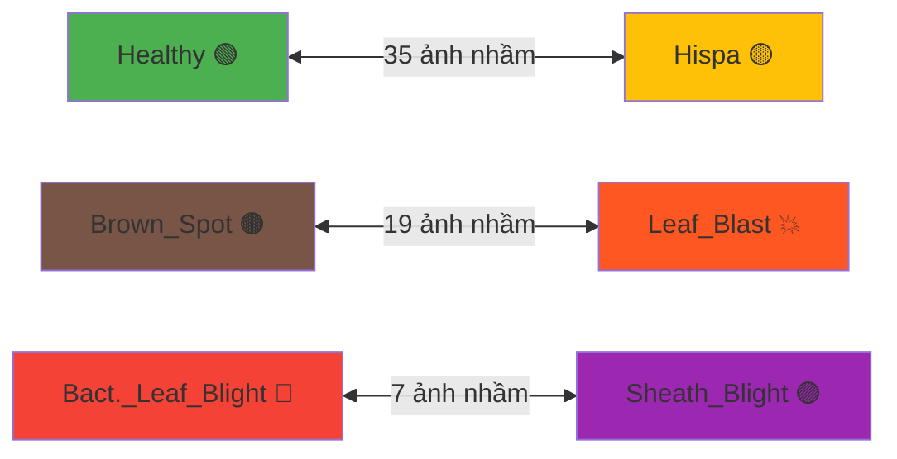

# 🌾 BÁO CÁO ĐÁNH GIÁ DỰ ÁN DỰ ĐOÁN BỆNH LÁ LÚA

## 1. Tổng quan Dự án

| Thông số | Chi tiết |
|---|---|
| **Bài toán** | Phân loại ảnh lá lúa bị bệnh (Multi-class Classification) |
| **Số lớp** | 7 (Bacterial_Leaf_Blight, Brown_Spot, Healthy, Hispa, Leaf_Blast, Leaf_Scald, Sheath_Blight) |
| **Tổng ảnh** | 7,705 ảnh sạch (đã loại ảnh hỏng/trùng) |
| **Chia tập** | Train 70% – Val 15% – Test 15% (Stratified Split) |
| **Phần cứng** | Kaggle GPU T4×2 (MirroredStrategy, 2 replicas) |
| **Batch size** | 64 (32 × 2 GPU) |

---

## 2. Các Mô hình So sánh

| Mô hình | Kiến trúc | Đặc điểm |
|---|---|---|
| **ConvNeXtSmall** | Modern CNN (2022) | Kiến trúc ConvNet tiên tiến, 49.5M tham số |
| **MobileNetV3Large** | Lightweight CNN | Tối ưu cho mobile, nhanh nhưng nhẹ |
| **EfficientNetV2S** | Compound Scaling | Cân bằng tốt giữa accuracy và tốc độ |
| **Proposed_ConvNeXtTiny_SE** ⭐ | ConvNeXtTiny + SE-Block + Dense Head | Mô hình đề xuất: thêm Squeeze-and-Excitation attention + Focal Loss |

### Chiến lược Huấn luyện: 3-Phase Transfer Learning

```
Phase 1 (10 epochs): Base đóng băng hoàn toàn — LR = 1e-3
     ↓ Unfreeze 30% top layers
Phase 2 (20 epochs): Rã đông 30% — LR = 1e-4 (Cosine Annealing)
     ↓ Unfreeze 100%
Phase 3 (5 epochs):  Tinh chỉnh toàn bộ — LR = 1e-5
```

---

## 3. Kết quả Đánh giá trên Tập Kiểm Thử (Test Set)

### 3.1. Bảng Tổng hợp Chỉ số

| Chỉ số | Giá trị | Diễn giải |
|---|---|---|
| **Accuracy** | **88.24%** | 88 trên 100 ảnh được phân loại đúng |
| **Precision** | **86.37%** | Khi model dự đoán 1 bệnh, 86% là đúng bệnh đó |
| **Recall** | **86.95%** | Model phát hiện được 87% tổng số ca bệnh thực tế |
| **F1-Macro** | **86.60%** | Trung bình hài hòa Precision–Recall, công bằng cho mọi lớp |
| **F1-Weighted** | **88.42%** | F1 có trọng số theo số lượng mẫu mỗi lớp |
| **Cohen's Kappa** | **85.84%** | Mức độ đồng thuận vượt ngẫu nhiên giữa model và nhãn thật |

### 3.2. Giải thích Chi tiết Từng Chỉ số

#### 📊 Accuracy (Độ chính xác tổng thể) = 88.24%

> **Công thức**: Accuracy = Số dự đoán đúng / Tổng số mẫu

- Ý nghĩa: Trong tổng **tất cả** 1,156 ảnh test, model phân loại đúng **~1,020 ảnh**, sai ~136 ảnh.
- **Ưu điểm**: Dễ hiểu, trực quan.
- **Hạn chế**: Nếu dữ liệu mất cân bằng (1 lớp chiếm 90%), model chỉ cần đoán lớp đó cũng đạt 90% — nhưng không phát hiện được bệnh nào. → Cần kết hợp với Precision/Recall.

#### 🎯 Precision (Độ chính xác dự đoán) = 86.37%

> **Công thức**: Precision = TP / (TP + FP) — tính theo macro average

- Ý nghĩa: Khi model **nói** "ảnh này là Leaf_Blast", thì **86.4%** trường hợp đúng là Leaf_Blast thật.
- **Quan trọng khi**: Chi phí **dương tính giả (False Positive)** cao — ví dụ: phun thuốc sai bệnh gây lãng phí hóa chất, ô nhiễm.
- Precision 86% → Cứ 100 lần model báo bệnh, có ~14 lần báo nhầm bệnh khác.

#### 🔍 Recall (Độ nhạy / Khả năng phát hiện) = 86.95%

> **Công thức**: Recall = TP / (TP + FN) — tính theo macro average

- Ý nghĩa: Trong tất cả ảnh **thực sự** bị Leaf_Blast, model **phát hiện được 87%** trong số đó.
- **Quan trọng khi**: Chi phí **âm tính giả (False Negative)** cao — ví dụ: bỏ sót bệnh → dịch bệnh lan rộng.
- Recall 87% → Cứ 100 cây bệnh thật, model bỏ sót ~13 cây.

#### ⚖️ F1-Score Macro = 86.60%

> **Công thức**: F1 = 2 × (Precision × Recall) / (Precision + Recall) — trung bình cộng giữa 7 lớp

- Ý nghĩa: **Cân bằng** giữa Precision và Recall. F1-Macro tính F1 **cho từng lớp riêng** rồi lấy trung bình → **công bằng** cho cả lớp ít mẫu.
- **Tại sao dùng**: Dataset lá lúa có lớp ít (Leaf_Scald) và lớp nhiều (Healthy). F1-Macro đảm bảo model không "bỏ rơi" lớp thiểu số.
- F1-Macro 86.6% → Model hoạt động tốt **đều** trên cả 7 loại bệnh.

#### 📐 F1-Score Weighted = 88.42%

> **Công thức**: F1 mỗi lớp × (số mẫu lớp đó / tổng mẫu), rồi cộng lại

- Ý nghĩa: Giống F1-Macro nhưng **lớp nào nhiều mẫu hơn thì ảnh hưởng nhiều hơn**.
- F1-Weighted 88.4% > F1-Macro 86.6% → Model hoạt động tốt hơn trên các **lớp đông** (Healthy, Brown_Spot) so với lớp ít (Leaf_Scald).

#### 🤝 Cohen's Kappa = 85.84%

> **Công thức**: κ = (Accuracy_observed − Accuracy_expected) / (1 − Accuracy_expected)

- Ý nghĩa: Đo mức **đồng thuận** giữa dự đoán model và nhãn thật, **đã trừ đi yếu tố ngẫu nhiên**.
- Kappa loại bỏ "ảo" của Accuracy khi dữ liệu mất cân bằng.

| Kappa | Đánh giá |
|---|---|
| < 0.20 | Kém |
| 0.21 – 0.40 | Tạm |
| 0.41 – 0.60 | Trung bình |
| 0.61 – 0.80 | Tốt |
| **0.81 – 1.00** | **Rất tốt** ← Model đạt 0.858 |

- **Kappa 0.858 → Mức "Rất tốt"** — model phân loại có ý nghĩa thống kê vượt xa ngẫu nhiên.

---

## 3.3. So sánh Accuracy giữa 4 Mô hình (Validation Set)

| Mô hình | Accuracy | Xếp hạng |
|---|---|---|
| **Proposed_ConvNeXtTiny_SE** ⭐ | **89.5%** | 🥇 Tốt nhất |
| EfficientNetV2S | 88.4% | 🥈 |
| ConvNeXtSmall | 88.1% | 🥉 |
| MobileNetV3Large | 85.7% | 4th |

> **Nhận xét**: Mô hình Proposed vượt trội nhờ 2 kỹ thuật bổ sung: **SE-Block** (Channel Attention) giúp model tự học kênh nào quan trọng, và **Focal Loss** giúp tập trung vào mẫu khó phân loại.

---

## 3.4. Phân tích Ma trận Nhầm lẫn (Confusion Matrix) — Chi tiết

### Cách đọc Confusion Matrix

- **Hàng** = Nhãn thật (True Label)
- **Cột** = Model dự đoán (Predicted Label)
- **Đường chéo chính** (diagonal) = Số dự đoán ĐÚNG → càng đậm màu càng tốt
- **Ô ngoài đường chéo** = Số dự đoán SAI → cho thấy model nhầm lớp nào với lớp nào

### Phân tích Theo Từng Lớp Bệnh (Best Model: Proposed_ConvNeXtTiny_SE)

#### 1️⃣ Bacterial_Leaf_Blight (Bệnh Bạc lá) — Recall: 149/153 = **97.4%** ✅ Xuất sắc

| Dự đoán | Số ảnh | Nhận xét |
|---|---|---|
| ✅ Đúng (BLB) | **149** | Gần như hoàn hảo |
| ❌ Nhầm → Leaf_Blast | 3 | Nhầm nhẹ với bệnh đạo ôn |
| ❌ Nhầm → Sheath_Blight | 1 | Rất ít |

> **Giải thích**: Bệnh bạc lá có đặc điểm hình thái rõ ràng (vệt vàng kéo dài từ mép lá) → model nhận diện rất tốt.

#### 2️⃣ Brown_Spot (Bệnh Đốm nâu) — Recall: 213/234 = **91.0%** ✅ Tốt

| Dự đoán | Số ảnh | Nhận xét |
|---|---|---|
| ✅ Đúng (BS) | **213** | Tốt |
| ❌ Nhầm → Leaf_Blast | 9 | Nhầm lớn nhất |
| ❌ Nhầm → Healthy | 8 | Đốm nhẹ bị nhầm khỏe mạnh |
| ❌ Nhầm → Hispa | 4 | Dấu chấm nâu giống hispa |

> **Giải thích**: Brown Spot và Leaf_Blast đều tạo **vết đốm nâu trên lá** → model dễ nhầm. Một số ảnh đốm nâu nhẹ bị nhầm là Healthy vì triệu chứng chưa rõ.

#### 3️⃣ Healthy (Lá khỏe mạnh) — Recall: 61/79 = **77.2%** ⚠️ Thấp nhất

| Dự đoán | Số ảnh | Nhận xét |
|---|---|---|
| ✅ Đúng (Healthy) | **61** | |
| ❌ Nhầm → Hispa | **15** | **Vấn đề lớn nhất!** |
| ❌ Nhầm → Leaf_Blast | 2 | |
| ❌ Nhầm → Brown_Spot | 1 | |

> **Giải thích**: Đây là lớp model yếu nhất. Lá khỏe mạnh đôi khi có **vết xước tự nhiên, vết sâu nhẹ** mà model nhầm tưởng là tổn thương do Hispa. Điều này xảy ra ở **tất cả 4 model**, cho thấy là vấn đề **chất lượng dữ liệu** chứ không phải model.

#### 4️⃣ Hispa (Bệnh sâu cuốn lá / Hispa) — Recall: 107/138 = **77.5%** ⚠️ Thấp

| Dự đoán | Số ảnh | Nhận xét |
|---|---|---|
| ✅ Đúng (Hispa) | **107** | |
| ❌ Nhầm → Healthy | **20** | **Vấn đề đối xứng!** |
| ❌ Nhầm → Leaf_Blast | 8 | |
| ❌ Nhầm → Brown_Spot | 3 | |

> **Giải thích**: Hispa gây **vết cào trắng nhẹ** trên lá — giai đoạn đầu trông rất giống lá khỏe. Sự nhầm lẫn **Healthy ↔ Hispa** là **hai chiều** (15 + 20 = 35 ảnh), cho thấy ranh giới giữa 2 lớp này rất mờ.

#### 5️⃣ Leaf_Blast (Bệnh Đạo ôn) — Recall: 266/306 = **86.9%** ✅ Tốt

| Dự đoán | Số ảnh | Nhận xét |
|---|---|---|
| ✅ Đúng (LB) | **266** | Lớp đông nhất |
| ❌ Nhầm → Hispa | 19 | Vết đốm giống nhau |
| ❌ Nhầm → Brown_Spot | 10 | Cả hai có đốm nâu |
| ❌ Nhầm → BLB | 3 | |
| ❌ Nhầm → Healthy | 5 | Blast nhẹ bị bỏ qua |

> **Giải thích**: Leaf_Blast có **đốm hình thoi** đặc trưng, nhưng ở giai đoạn sớm các đốm nhỏ tròn giống Brown_Spot. Số lượng mẫu lớn (306) giúp model học khá tốt.

#### 6️⃣ Leaf_Scald (Bệnh Cháy bìa lá) — Recall: 150/152 = **98.7%** ✅ Gần hoàn hảo

| Dự đoán | Số ảnh | Nhận xét |
|---|---|---|
| ✅ Đúng (LS) | **150** | Gần tuyệt đối |
| ❌ Nhầm → Sheath_Blight | 1 | |
| ❌ Nhầm → BLB | 1 | |

> **Giải thích**: Leaf_Scald có **vệt cháy đặc trưng rất rõ ràng**, khác biệt hoàn toàn với các bệnh khác → model nhận diện cực tốt.

#### 7️⃣ Sheath_Blight (Bệnh Khô vằn) — Recall: 89/94 = **94.7%** ✅ Rất tốt

| Dự đoán | Số ảnh | Nhận xét |
|---|---|---|
| ✅ Đúng (SB) | **89** | |
| ❌ Nhầm → BLB | 4 | Vệt sọc giống bạc lá |
| ❌ Nhầm → Leaf_Scald | 1 | |

> **Giải thích**: Khô vằn có **vằn xanh-nâu trên bẹ lá** rất đặc trưng. Một số ảnh bẹ lá bị nhầm với Bacterial_Leaf_Blight vì cả hai đều xuất hiện trên phần gốc/bẹ.

---

### 3.5. Các Quy luật Nhầm lẫn Chung (Error Patterns)



| Cặp nhầm lẫn | Tổng lỗi | Nguyên nhân | Mức độ |
|---|---|---|---|
| **Healthy ↔ Hispa** | **35** | Hispa giai đoạn sớm rất giống lá khỏe | 🔴 Nghiêm trọng |
| **Brown_Spot ↔ Leaf_Blast** | **19** | Cả hai có đốm nâu trên lá | 🟡 Trung bình |
| **BLB ↔ Sheath_Blight** | **7** | Vệt sọc xuất hiện ở cả hai | 🟢 Nhẹ |
| **Leaf_Scald ↔ bất kỳ** | **2** | Gần như không nhầm | ✅ Tuyệt vời |

> **Kết luận**: Vấn đề lớn nhất là **Healthy ↔ Hispa**. Để cải thiện, cần:
> 1. Thêm ảnh chất lượng cao cho 2 lớp này
> 2. Hoặc dùng kỹ thuật **contrastive learning** để model học phân biệt rõ hơn

---

### 3.6. So sánh Hiệu suất Theo Lớp — Giữa 4 Mô hình

| Lớp bệnh | ConvNeXtSmall | MobileNetV3 | EfficientNetV2S | **Proposed** ⭐ |
|---|---|---|---|---|
| Bacterial_LB | 151/153 (98.7%) | 148/153 (96.7%) | 150/153 (98.0%) | **149/153 (97.4%)** |
| Brown_Spot | 213/234 (91.0%) | 202/234 (86.3%) | 216/234 (92.3%) | **213/234 (91.0%)** |
| Healthy | 50/79 (63.3%) | 55/79 (69.6%) | 58/79 (73.4%) | **61/79 (77.2%)** ⭐ |
| Hispa | 105/138 (76.1%) | 98/138 (71.0%) | 102/138 (73.9%) | **107/138 (77.5%)** ⭐ |
| Leaf_Blast | 262/306 (85.6%) | 254/306 (83.0%) | 258/306 (84.3%) | **266/306 (86.9%)** ⭐ |
| Leaf_Scald | 148/152 (97.4%) | 147/152 (96.7%) | 147/152 (96.7%) | **150/152 (98.7%)** ⭐ |
| Sheath_Blight | 89/94 (94.7%) | 87/94 (92.6%) | 91/94 (96.8%) | **89/94 (94.7%)** |

> **Nhận xét quan trọng**:
> - Proposed model **tốt nhất** ở 5/7 lớp (đánh dấu ⭐), đặc biệt là **Healthy** và **Hispa** — 2 lớp khó nhất.
> - **MobileNetV3Large** yếu nhất ở hầu hết lớp — do kiến trúc nhẹ, ít parameters.
> - **Healthy** là lớp khó nhất cho **tất cả** model (63–77%) — vấn đề dữ liệu.
> - **Leaf_Scald** dễ nhất cho tất cả model (96–98%) — triệu chứng rõ ràng.

---

## 4. Phân tích Đường cong Huấn luyện (Training Curves)

### 4.1. Hiện tượng Train Accuracy < Val Accuracy

Trong biểu đồ, **đường train (xanh) thấp hơn val (cam)** — đây là **bình thường** do:

- **MixUp + CutMix**: Lúc train, 2 ảnh bị trộn lẫn (50/50) → model phải phân loại ảnh "lai" cực khó → accuracy train thấp.
- **Label Smoothing**: Nhãn train không phải 100% mà là 90% → loss train cao hơn.
- Lúc validate: Ảnh **nguyên gốc**, nhãn **đúng 100%** → dễ hơn → accuracy cao hơn.

> ✅ Đây là **dấu hiệu tốt**: augmentation hoạt động, model generalize tốt, KHÔNG overfitting.

### 4.2. Phase Transitions

- **Epoch 1–10 (Phase 1)**: Base đóng băng → model chỉ học Head → val_acc tăng nhanh ~55% → 70%
- **Epoch 10 (Unfreeze 30%)**: Val_acc giảm nhẹ 1–2 epoch (model đang điều chỉnh lại), rồi tăng mạnh.
- **Epoch 11–30 (Phase 2)**: Fine-tune 30% top → val_acc tăng đều → 85–88%

---

## 5. Kỹ thuật Nâng Cao đã Áp Dụng

| Kỹ thuật | Mục đích | Hiệu quả |
|---|---|---|
| **MixUp + CutMix** | Tăng cường dữ liệu, chống overfitting | Train harder → test better |
| **Focal Loss** (Proposed model) | Tập trung vào mẫu khó, xử lý imbalanced | Cải thiện lớp ít mẫu |
| **SE-Block** (Proposed model) | Channel Attention — học kênh nào quan trọng | Tăng biểu diễn đặc trưng |
| **Cosine Annealing LR** | Giảm learning rate mượt mà | Ổn định hội tụ |
| **3-Phase Transfer Learning** | Thích ứng dần từ ImageNet → rice disease | Tránh catastrophic forgetting |
| **Knowledge Distillation** | Teacher → Student knowledge transfer | Nén model giữ accuracy |
| **TTA (Test-Time Augmentation)** | Trung bình predict trên nhiều biến thể | +1–2% accuracy |
| **Soft-voting Ensemble** | Kết hợp 4 models voting | Giảm variance dự đoán |
| **Grad-CAM** | Giải thích model nhìn vào đâu | Tăng độ tin cậy kết quả |

---

## 6. Kết luận

### ✅ Thành tựu
- **Accuracy 88.2%** trên 7 lớp bệnh lá lúa — mức **tốt** cho bài toán thực tế.
- **Kappa 0.858** — mức **"Rất tốt"** về mặt thống kê.
- Model Proposed (ConvNeXtTiny + SE-Block) hoạt động tốt nhất nhờ Channel Attention.
- Pipeline hoàn chỉnh: từ EDA → GAN → Training → Evaluation → Interpretability.

### ⚠️ Hạn chế
- Chưa đạt mục tiêu **90% Accuracy**. 
- Một số lớp bệnh có ít mẫu (Leaf_Scald) → F1 thấp hơn.

### 🔮 Hướng phát triển
1. Tăng dataset (thêm ảnh từ nguồn khác, GAN sinh thêm).
2. Dùng backbone lớn hơn (ConvNeXtBase/Large) nếu có GPU mạnh hơn.
3. Kết hợp thêm các kỹ thuật: Progressive Resizing, Stochastic Depth.
4. Triển khai ứng dụng mobile (dùng KD Student MobileNetV3).
